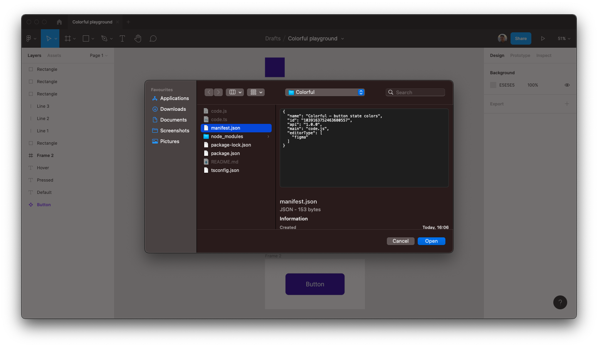

# Colorful

Colorful is a Figma plugin for generating colors for button states:

- Default
- Hover
- Pressed


---

## Contents

1. [Description](#description)
> * [Project description](#project-description)
> * [Brief artifact description](#brief-artifact-description)
> * [Demo](#demo)
2. [Project requirements](#project-requirements)
> * [Glossary](#glossary)
> * [User Stories](#user-stories)
3. [Design](#design)
> * [UML Diagram description](#uml-diagram-description)
6. [Installation](#installation)

---

# Description

## Project description

When UI Designers create buttons, they need to think about behaviour of interactive elements. Particularly, common states for button are:

- Default: nothing happens with the button, it rests
- Hover: a pointer enters its region, it highlights
- Pressed: the mouse clicks, and the button gets darker

A lot of interface designers use [Figma](https://www.figma.com) to create design systems with UI kits. As creating button states requires repetitive manual actions, I have built a Figma plugin to perform this task.

- It automates color generation process and speed up designers' workflow
- It yields more consistent results (plugin uses the same lighten and darken values)

## Brief artifact description

You can find full project document here: [https://www.notion.so/RUP-artifacts-for-Colorful-f2202e90952c40ff9f27932d8ddbd8a0](https://www.notion.so/RUP-artifacts-for-Colorful-f2202e90952c40ff9f27932d8ddbd8a0)

There you can find:

- Business Goals
- Stakeholders and their responsibilities
- Functional and requirements
- Software Development plan

## Demo: how it works

The plugin takes a color of a selected object on cavas inside Figma file. Then it generates:

- a lighter color for Hover state (step up by 15% in every RGB channel)
- a darker color for Pressed state (step down by 15% in every RGB channel)

To generate the state colors:

1. Select a rectangle with a color fill
2. In top menu, select `Plugins` → `Development` → `Colorful — button state colors`
3. Now you can see 3 squares appeared in the center of your canvas. 
    1. The first one is Default color (the one you provided)
    2. The second one is Hover color (lighter)
    3. The third one is Pressed color (darker)
4. Now you can use these colors on your buttons in mockups and prototypes.
5. *Bonus*. Duplicate [this Figma file](https://www.figma.com/file/Z6EYt4NGv4gBgkmnYbn7e5/Colorful-playground?node-id=0%3A1) to try out the playground scene in the demo video.
    
    
    


# Project requirements

## Glossary

- **Figma** — a web-based user interface design tool.
- **UI** — is anything a user may interact with to use a digital product or service.
- **RGB** (Red, Green, Blue) — primary colors in additive color synthesis. A RGB file consists in composite layers of Red, Gree, and Blue, each being coded on 256 levels from 0 to 255. In project scope we transform the range 0-255 (integer) to 0-1 (float).
- **Button states** — visual indicators that let the user know whether they can click or have clicked, or had successfully clicked a button.

## User stories

[User stories](https://www.notion.so/130e60a5b1394c0ba11c83721f603387)

# Design

## UML Diagram description


# Installation

### Clone repository

1. Open Terminal
2. Change the current working directory to the location where you want the cloned directory
3. Type
    
    ```bash
    > git clone https://github.com/fed0rus/Colorful.git
    ```
    
4. Press **Enter** to create your local clone
    
    ```bash
    > git clone https://github.com/fed0rus/Colorful.git
    Cloning into 'Colorful'...
    remote: Enumerating objects: 42, done.
    remote: Counting objects: 100% (42/42), done.
    remote: Compressing objects: 100% (29/29), done.
    remote: Total 42 (delta 11), reused 38 (delta 8), pack-reused 0
    Receiving objects: 100% (42/42), 17.80 KiB | 2.22 MiB/s, done.
    Resolving deltas: 100% (11/11), done.
    ```
    

*The following instructions are taken from [Figma Plugin development setup guide.](https://www.figma.com/plugin-docs/setup/)*

### Install Visual Studio Code

Visual Studio Code can be downloaded here: [https://code.visualstudio.com/](https://code.visualstudio.com/)

### **Install Node.js and NPM**

You can download Node.js here, which will include NPM: [https://nodejs.org/en/download/](https://nodejs.org/en/download/)

### **Install** TypeScript

To install TypeScript, run `sudo npm install -g typescript` in your terminal. (This isn't installed by Visual Studio Code).

### Get the Figma desktop app

At this time, plugin development and testing needs to be done using the Figma desktop app. This is because Figma needs to read your code saved as a local file. The Figma desktop app can be downloaded here: [https://www.figma.com/downloads/](https://www.figma.com/downloads/).

If you already have the desktop app, please make sure to update to the latest version, as several features have been added specifically in order to provide a better plugin development experience.

### **Log in to your account and open the file editor in the Figma desktop app**

You can open any existing document or create a new one.

### **Go to Menu > Plugins > Development > Import plugin from manifest...**

Choose the file `manifest.json` that is in folder where you cloned the repository.



### **Install the typings**

Run `npm install --save-dev @figma/plugin-typings`

### **Set up TypeScript compilation**

Hit ⌘⇧B (Ctrl-Shift-B for Windows) in Visual Studio Code, then select `tsc: watch - tsconfig.json`. This tells Visual Studio Code to compile `code.ts` into `code.js`. It will watch for changes to `code.ts` and automatically re-generate `code.js` every time `code.ts` is saved.

### **Run the plugin**

Running proccess is described above, in the [Demo section.](#demo)

---

The project is based on [Figma Plugin template.](https://www.figma.com/plugin-docs/setup/)
